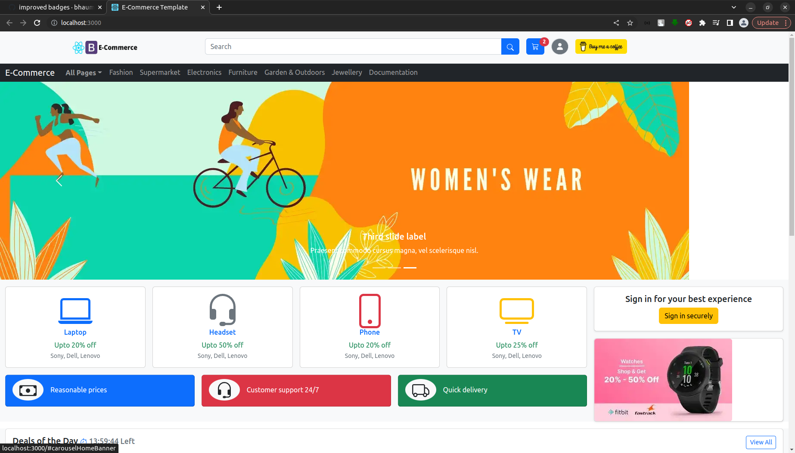
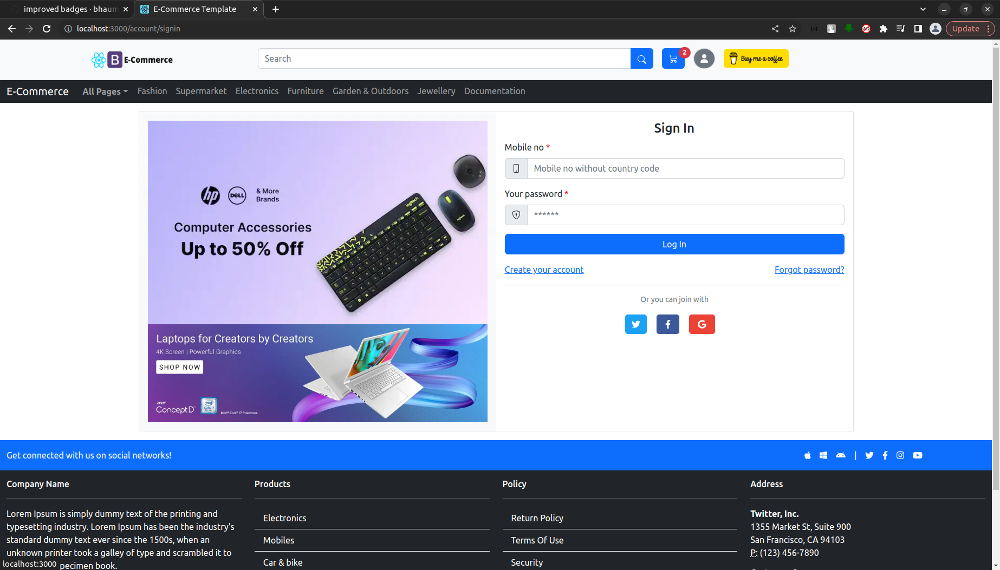
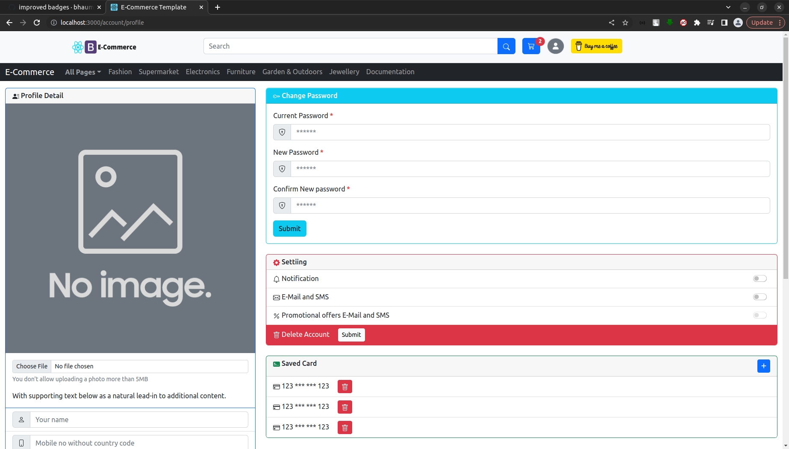
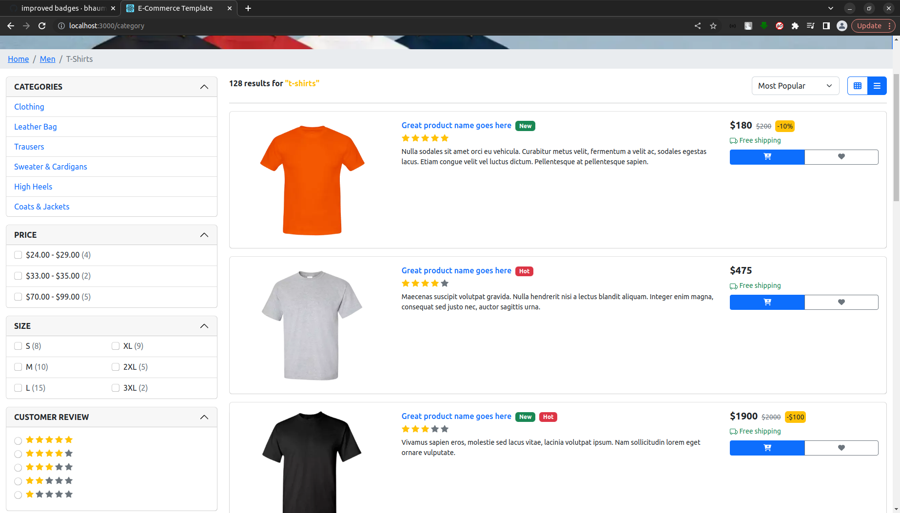

  

<h3 align="center">E-Commerce Template</h3>

 Built with React JS, Bootstrap 5
   

## E-Commerce Template

Built with React JS and Bootstrap 5

## Screen shot

## Table of contents

- [Quick start](#quick-start)
- [What's included](#whats-included)

## Quick start

- Install with [npm](https://www.npmjs.com/): `npm install`
- Runs the app in the development mode `npm start`
- Builds the app for production to the `build` folder `npm run build`

## What's included

- Sign Up
- Sign In
- Forgot Password
- Home Page
- Product List (List/Grid View)
- Product Detail
- Cart
- Checkout
- My Account (Change Password, Setting, Saved Card)
- Star Zone Page
- Orders
- Wishlist's
- Notification
- Support
- Contact Us
- Blog
- Blog Detail Page
- Error Page (404, 500)

## Thanks

